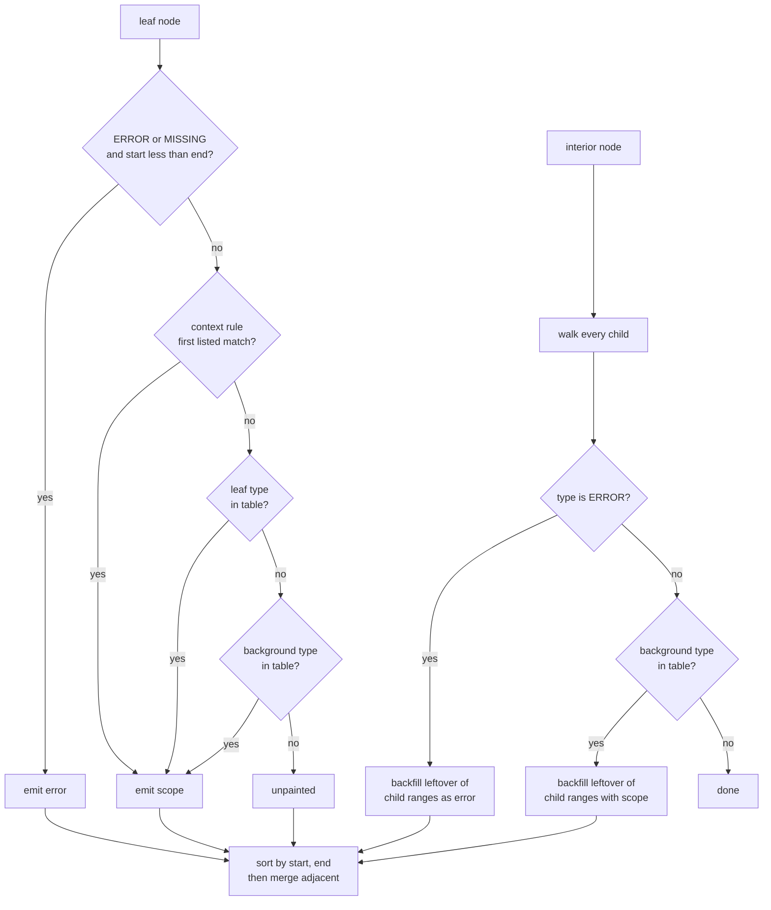
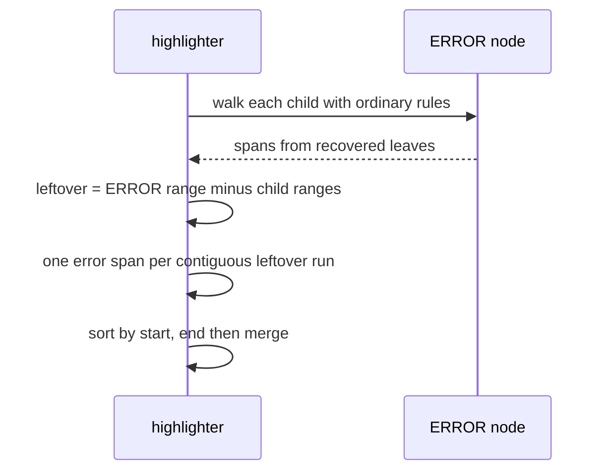
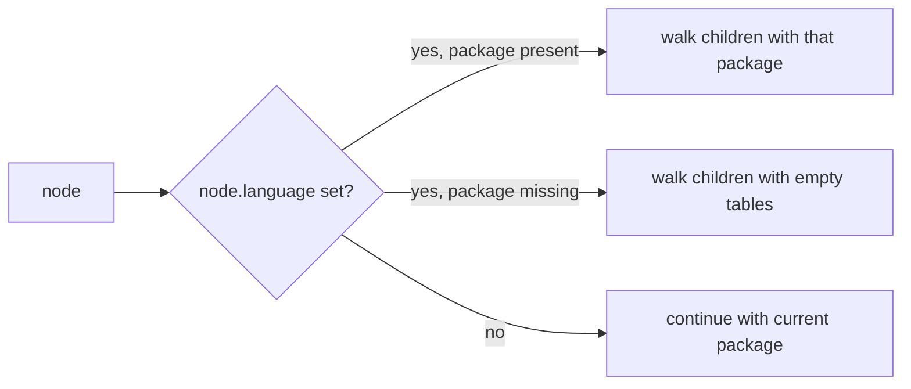

# Highlight packages: two files, one tree, no query engine

Date: 2026-08-15 Status: Draft

Follow-up: 2026-08-16

A highlight package is a second, smaller data file per language: a leaf-type
table, an opt-in background table, and an ordered context list that matches
parent type and field. Type-only dispatch — the formatter's whole bet — cannot
tell a Python identifier that is a callee from one that is a value. There is no
black for highlighting; honesty is rust/js span-stream identity plus goldens we
write ourselves. The highlighter never refuses a tree. The walker is a different
function from the formatter's, and the 1 ms/keystroke budget is a parse claim
this slice does not answer.

## Background

This project is named for two halves. The formatter works: two languages merged,
both runtimes byte-identical, packages that are data. The highlighter does not
exist. Fifteen more languages are queued to onboard against the formatter alone.

`docs/design.md` (August 2026) already said they share a parse tree and nothing
else. That sentence is still right. The layout next to it is not:
`et-highlight  capture queries -> span stream (thin)` was never built, and
"queries" is the wrong word. The landscape sizes in that document I re-verified
today; the architectural sketch I am throwing out.

A web editor hits the highlighter on every page load and the formatter on save.
Their requirements are opposed, and that table is the one part of
`docs/design.md` this paper rests on:

|                 | highlighter                            | formatter                            |
| --------------- | -------------------------------------- | ------------------------------------ |
| tree quality    | error-tolerant, partial, viewport-only | complete, correct, comments attached |
| latency budget  | ~1 ms per keystroke                    | ~50 ms on save                       |
| on syntax error | degrade gracefully                     | refuse to run                        |
| wrong output    | ugly colours                           | **corrupted source**                 |
| incrementality  | essential                              | irrelevant (whole file)              |

Today there is no parser in either runtime. Trees are frozen by
`harness/gen_trees.py`, which refuses to emit `ERROR` or `MISSING`. The
highlighter's latency budget is a _parse_ claim. This paper is about the package
format. Those are different questions; mixing them is how a data-format slice
grows a scanner VM.

## Goals

1. A data-only highlight package both runtimes interpret, in the same voice as
   `et-doc-rules/1`.
2. Concrete enough to hand a builder a JSON and Python package and a walker
   spec.
3. A differential-testing story that does not pretend a reference highlighter
   exists.
4. An ERROR rule, written down, because nothing in the current design has one.

## Non-goals

- A parser, a scanner VM, or incrementality. Viewport-only span updates are a
  walker _call_, not a package feature.
- Themes, colours, CSS. The package emits scope names. The editor maps them.
- Matching nvim-treesitter, Helix, or GitHub. They disagree with each other.
- Locals / semantic colouring of "this is the same variable".
- Builtin word lists (`print`, `len`, `self`) and identifier-text heuristics
  (`^[A-Z]`). Those are the first two temptations after this design ships; they
  are not in it.
- Reopening roadmap point 3 (grammar/package coupling). A header field is
  reserved. The runtime ignores it in v1.

## Prior art (only what changes a recommendation)

### tree-sitter queries are the baseline to refuse

Python's grammar-repo query is
[`tree-sitter-python/queries/highlights.scm`](https://github.com/tree-sitter/tree-sitter-python/blob/master/queries/highlights.scm)
(1,957 raw / 852 gzip, scorer compressor). 24 captures, 17 unique names,
**three** `#match?` predicates, and **no** `locals.scm` or `injections.scm` —
the directory is `highlights.scm` + `tags.scm`. The rules that split
`identifier` are:

```scm
(identifier) @variable

(call
  function: (identifier) @function)

(function_definition
  name: (identifier) @function)

(type (identifier) @type)

(attribute attribute: (identifier) @property)

((identifier) @constructor
 (#match? @constructor "^[A-Z]"))

((identifier) @constant
 (#match? @constant "^[A-Z][A-Z_]*$"))
```

JSON's grammar-repo query is six captures and zero predicates (172 raw / 138
gzip):

```scm
(pair
  key: (_) @string.special.key)
(string) @string
(number) @number
```

Helix and nvim-treesitter are what people actually run, and they diverge. Helix
Python is 7,178 raw / 2,364 gzip, 81 captures, 13 predicates (`#any-of?`,
`#eq?`, `#match?`). nvim-treesitter Python is 8,964 raw / 2,682 gzip, 114
captures, 20 predicates (`#any-of?`, `#eq?`, `#lua-match?`). nvim-treesitter's
own CONTRIBUTING.md says it **does not use locals for highlighting**.

So: the closest prior art already spends most of its Python query on
parent/field patterns plus a pile of text predicates the grammar-repo query
mostly skips. A query _engine_ is not what is carrying the interesting cases.
Parent and field are.

`tags.scm` is code navigation (`@definition.function`, `@reference.call`). Not
highlighting. Discarded.

### `tree-sitter-highlight` is a span event stream over a query matcher

Crate source: `crates/highlight/src/highlight.rs` on `tree-sitter/tree-sitter`
master. `HighlightConfiguration::new` concatenates three query strings
(injections, locals, highlights) into one `Query`. Output is:

```rust
pub enum HighlightEvent {
    Source { start: usize, end: usize },
    HighlightStart(Highlight),
    HighlightEnd,
}
```

Nested, not a partition. `"error"` is a standard capture name; there is no
special-case ERROR walker. ERROR nodes highlight if a query captures them, and
their children highlight if other queries match. The crate also _parses_. We
would be using the event shape and the ERROR indifference, not the query
matcher, and not the parser.

### Lezer `styleTags` is the shape I would steal

[`@lezer/python` `src/highlight.js`](https://github.com/lezer-parser/python/blob/main/src/highlight.js)
(1,276 raw / 597 gzip) is not a query file. It is a map from node paths to tags:

```javascript
VariableName: t.variableName,
"CallExpression/VariableName": t.function(t.variableName),
"FunctionDefinition/VariableName": t.function(t.definition(t.variableName)),
"ClassDefinition/VariableName": t.definition(t.className),
"CallExpression/MemberExpression/PropertyName": t.function(t.propertyName),
```

[`@lezer/json` `src/highlight.js`](https://github.com/lezer-parser/json/blob/main/src/highlight.js)
is 279 raw / 200 gzip: `String`, `Number`, `PropertyName`, punctuation. No
paths. JSON does not need them.

Lezer paths are parent chains because Lezer trees often do not carry
tree-sitter-style field names. Ours do (`field` is on the node in
`rust/src/tree.rs`). The same distinctions collapse to
`(parent.type, node.field, node.type)` plus, for `obj.method()`, the parent
node's own field.

Sizes I measured today, `gzip.compress(data, 9)`, same compressor as
`harness/score.py:gzipped`. `@lezer/lr` 1.4.10 is 17,555 gzip — the 17.5 KB in
`docs/design.md` still holds. `@lezer/python` 1.1.19 is 16,838.
`@lezer/javascript` 1.5.4 is 30,545. `@lezer/rust` 1.0.2 is 25,129.
`@lezer/highlight` 1.2.3 is 8,122. The August 2026 landscape table is not stale
on the numbers; it is stale on `et-highlight`.

### syntect / vscode-textmate

Still the existence proof that two idiomatic implementations can read one data
package, and still unusable here. `docs/design.md` named the reason: TextMate
grammars are regex soup, line-oriented, produce no tree, and `syntect`'s
`fancy-regex` backend diverges from Oniguruma. `fancy-regex` as of this writing
still "aims to be compatible with Oniguruma syntax when the relevant flag is
set" — that is not identity. I am not reopening TextMate.

### Aven is not a token-level regex highlighter

`docs/onboarding/LANGUAGES.md` guessed `~/w/clex/aven-lang/editors/` was "very
likely a token-level regex/TextMate-style definition". It is not. There is no
TextMate grammar. `editors/nvim/aven.lua` starts `aven lsp`; highlighting is LSP
semantic tokens from `crates/aven-lsp/src/semantic_tokens.rs`. Classification
is:

1. a lexical default (`Identifier` → `variable`, `ComptimeIdentifier` → `type`,
   keywords, strings, numbers);
2. AST overrides from binder sites and declarations (callable → `function`,
   parameter/iteration → `parameter`, record field labels → `property`).

That is the same two-layer shape this paper proposes, written against Aven's own
AST rather than against a CST table. Aven will want a highlight package written
against Aven's node types, the way `tree-interface-probe.md` already says to
write `packages/aven.json`. It does not want us to impersonate
tree-sitter-python.

## The four questions

### 1. One package per language, or two?

Two files. One tree.

The tree question is already closed. `docs/injection.md` puts one optional
`language` field on a node; the harness splices; both halves read the same CST.
I agree. Inventing a second tree shape for highlighting would throw away the
only shared machinery that exists.

The _download_ question is not the tree question. `docs/design.md` left it open:
two is cleaner but doubles requests; one wastes bytes for viewers who never
format. I would ship two files:

- `packages/python.json` — `et-doc-rules/1`, as today
- `packages/python.highlight.json` — `et-highlight/1`

because:

1. A viewer never formats. Charging them 1,999 gzip of Doc rules (measured
   today, `packages/python.json`) to colour a buffer is the waste the open
   question named.
2. The two packages change on different clocks. A highlight package can grow a
   context row without touching format agreement against black.
3. Injection already wants a _package map_. Two maps (format, highlight) is
   cleaner than one object with two optional halves and a loader that has to
   know which half you meant.
4. Combining them later is a serving trick (concatenate, or a bundle endpoint).
   It is not a format decision. Do not bake a bundle into v1 so a CDN can save
   one round trip.

JSON's format package is 353 gzip. Its highlight package, as proposed below, is
274 gzip. The wasted-bytes argument is real for Python and will get more real as
format packages grow policies; it is already the wrong way around for a
read-only viewer.

**Recommendation: two packages, one tree. Files sit next to each other; the
suffix distinguishes them.**

### 2. Is a capture table enough? Is type-only enough?

A capture table in the tree-sitter sense is a query file. We do not need one.
Type-only dispatch, the formatter's bet, is not enough. Parent type plus field
is.

The formatter dispatches on `node.type` alone (`rust/src/eval.rs` `Fmt::node`,
`self.pkg.rules.get(&node.kind)`). Selectors (`f:name`, `t:identifier`, `named`,
`*`) pick _children_. They do not change which rule runs. `DESIGN.md` names this
as a limit: "Context-dependent rules. Dispatch is on node type alone."

Python trees use one type `identifier` everywhere. I counted 632 of them across
the twelve corpus trees, and 56 distinct `(parent.type, field)` pairs. The ones
that must not share a colour, taken from the actual trees and from the queries
above:

| Source span     | parent                     | field       | type-only paints | wanted    |
| --------------- | -------------------------- | ----------- | ---------------- | --------- |
| `compute(...)`  | `call`                     | `function`  | identifier       | function  |
| `alpha` in args | `argument_list`            | —           | identifier       | variable  |
| `result =`      | `assignment`               | `left`      | identifier       | variable  |
| `def short`     | `function_definition`      | `name`      | identifier       | function  |
| `class …`       | `class_definition`         | `name`      | identifier       | type      |
| `: int`         | `type`                     | —           | identifier       | type      |
| `def f(a, b)`   | `parameters`               | —           | identifier       | parameter |
| `method="POST"` | `keyword_argument`         | `name`      | identifier       | parameter |
| `*args`         | `list_splat_pattern`       | —           | identifier       | parameter |
| `**kwargs`      | `dictionary_splat_pattern` | —           | identifier       | parameter |
| `obj.attr`      | `attribute`                | `attribute` | identifier       | property  |
| `query.filter(` | `attribute` (and that      | `attribute` | identifier       | function  |
|                 | attribute's field is       |             |                  |           |
|                 | `function`)                |             |                  |           |

`corpus/trees/python__calls.tree.json` is the first row and the second, in one
assignment. `python__defs.tree.json` is the def-name / parameter / splat / `int`
annotation rows (`first` under `parameters`, `args` under `list_splat_pattern`
at `[383, 387]`, `kwargs` under `dictionary_splat_pattern` at `[410, 416]`).
`python__chains.tree.json` is `query.filter`: the callee is an `attribute` whose
own `field` is `function`, and the identifier `filter` has `field: "attribute"`.
That last case needs the **parent node's field**, which our CST already carries.
It does not need a query engine.

What a type-only table actually does to that file: every name is the same
colour. That is not "a bit less nice". It is the thing people mean by Python
highlighting.

What we do **not** need for the cases that break:

- A query matcher. There is no sibling walk, no `#eq?` on a cousin, no
  capture-and-predicate.
- `locals.scm`. tree-sitter-python does not ship one. nvim-treesitter does not
  use one for colour.
- `#match?` on identifier text. PascalCase constructors and `SCREAMING`
  constants are taste. The grammar-repo query is the smallest prior-art file
  that treats those predicates as load-bearing (two `#match?` on `identifier`);
  Helix adds `#match?` for `^[A-Z]` / `^_*[A-Z][A-Z\\d_]*$`, and nvim-treesitter
  piles on nine `#lua-match?`. Out of v1 anyway.
- `#any-of?` builtin lists. Same. The first policy I would add _after_ the
  pilot, if the corpus looks naked without `print` / `len` / `self`. A word
  table is still not a query engine.

The smallest mechanism that covers what actually breaks: **an ordered context
list, first listed match wins, matching the leaf and its immediate parent (see
the key table below), then a leaf-type default.**

`ancestor` is for type annotations that wrap the identifier in extra nodes. In
`python__defs.tree.json` the annotation is
`type / generic_type / type_parameter / type / identifier` — `list` `[299, 303]`
sits under `generic_type` under `type`; `int` `[304, 307]` sits under an inner
`type`. There is no `subscript` under any `type` in the twelve corpus trees
(`subscript` is a value, e.g. `registry["handlers"]`). Helix writes four nested
`_` levels for `[]` / `.` / `|` nesting; `ancestor: "type"` covers `list`,
`int`, `dict`, `str`, and `bool` on this file if the path **includes** the
immediate parent. That is cheaper than a query language and matches how Aven
already overrides lexical defaults from an AST walk.

**Recommendation: not a capture-query table, and not type-only. A leaf table
plus an ordered context list. First listed match wins, so both runtimes agree
without a specificity algorithm.**

The 2026-08-16 follow-up keeps that context decision and adds the separate
background table recorded in Key Decision 10.

### 3. What is the differential-testing story?

There is no reference highlighter.

Black and prettier are ground truth for the formatter because they define a
function from source to source, and because this project chose those two as the
house style. Highlighting is not that function. Helix, nvim-treesitter, the
grammar-repo queries, Lezer `styleTags`, and GitHub (via
`tree-sitter-highlight`) already disagree on Python `identifier` — Helix and
nvim add builtin lists and `self`/`cls`; the grammar repo uses `#match?` for
constructors; Lezer uses parent paths and no text predicates. Picking one of
them as "black" would be picking a taste and then spending the rest of the
project explaining every divergence as a limit. The formatter already has that
problem against black, and there the reference at least claims to be _the_
style.

What replaces it:

1. **Rust/JS identity on the span stream.** Same bar as gate 1. The stream is
   the output. If they disagree, one of them is wrong. This is what keeps two
   implementations honest, and it does not need a third party.
2. **Goldens we write.** For each corpus tree, a committed span file. The first
   draft of those goldens is the walker's own output, reviewed like a package.
   Subsequent changes are diffs against that. This is how tree-sitter's own
   highlight tests work (caret comments in `test/highlight/`), just with a JSON
   span list instead of `// ^ function` because our output is a stream, not an
   editor buffer.
3. **Invariants, not agreement with a stranger.**
   - spans ordered by `start`, then `end`
   - `start < end`
   - non-overlapping
   - offsets are UTF-8 bytes into `tree.source`
   - adjacent same-scope spans are merged
   - every span's scope is in the package's `scopes` list
   - the union of spans need _not_ cover the source (whitespace is a gap, as in
     the CST)
4. **Optional coverage probe, never a gate.** Run `tree-sitter-highlight` with
   the grammar-repo query on the same source and report "our spans that have no
   overlapping tree-sitter span" / the reverse. Informative. Not a pass/fail.
   The names will not match (`function` vs `function.call` vs
   `tags.function(tags.variableName)`).

The existing harness (agreement, idempotence, nondestruction) is
formatter-shaped. A highlight harness asserts (1) and (3) on every tree, (2)
against committed goldens, and _does not_ assert idempotence (highlighting is
not an endomorphism) or nondestruction (it does not emit source). Gate 3 is
meaningless here.

ERROR trees will not come from `gen_trees.py`. They are hand-built fixtures, the
way `tree-interface-probe.md` built the second half of its cases. That is the
only way to test the ERROR rule until the harness is willing to emit dirty
trees.

**Recommendation: no reference highlighter. Identity plus goldens plus a
partition invariant. A well-argued absence is the result.**

### 4. Error tolerance

The formatter refuses a tree containing an `ERROR` node. `harness/gen_trees.py`
will not even emit one. `tree-interface-probe.md`: an extra child the rule does
not mention — whitespace, a wrapper, an `ERROR` — is a refusal, not a skip.
`rust/src/eval.rs` is the same sentence in code: unknown type refuses,
unconsumed child refuses.

A highlighter must colour the buffer anyway. Nothing in the current design says
how, and this is the sharpest place the two halves cannot share machinery.

The rule, as data, is:

1. **The highlighter never refuses a tree.** A malformed _package_ still refuses
   at load, in the same voice as `et-doc-rules/1`. A tree does not.
2. **Unknown node types are skipped, not guessed and not refused.** An interior
   node we do not mention is walked for children. A leaf we do not mention is
   unpainted. Incomplete packages are quiet at runtime and loud in golden
   review. That is the opposite of the formatter, and it is right: ugly colour
   is the failure mode, not a blank editor.
3. **`ERROR` is walked, then backfilled by child range.** Children of `ERROR`
   are highlighted by the ordinary rules — a recovered `identifier` is still an
   identifier, a recovered `call` is still a call. After the children, every
   byte in `[error.start, error.end)` that no **child's `[start, end)`** covers
   is emitted as `error`, one span per contiguous leftover run. Gaps _inside_ a
   recovered child stay ordinary gaps (unpainted whitespace). That is the
   "degrade" half: we colour what we recognise and stain the rest of the ERROR
   node, not the insides of what it recovered.
4. **Leaf `ERROR` / `MISSING`.** No children and `start < end`: emit
   `{start, end, error}`. Zero-width `MISSING` (and zero-width `ERROR`) is a
   no-op. The two special types share this sentence.
5. **Unconsumed children are not a concept.** There is no cursor and no
   consumption. Every child is visited. Linearity-as-consumption does not
   transfer.
6. **Sort, then merge.** Children emit first; leftover runs emit after. The
   stream is not yet ordered. After the walk: sort by `(start, end)`, then merge
   adjacent same-scope spans. The invariant is on that finished list.

This is why the highlighter walker and the formatter walker must not be the same
function. A shared `walk` that takes a "on unknown / on extra child" callback
will grow a third mode, then a fourth, and both halves will get worse. Two
functions, one tree.

Injection, specifically: `docs/injection.md` says the highlighter gets the
`language` field for free. The _field_, yes. The _degrade policy_, no. The
formatter's harness unstamps `language` when the embedded parse yields `ERROR`,
so the runtime is never asked to format a dirty subtree. The highlighter _wants_
that dirty subtree if the harness can produce it — a broken JavaScript fence
should still colour its strings and stain the rest. "Degrading is the harness's
job, refusing is the runtime's" is the formatter's rule. The highlighter's is:
**degrading is the walker's job.** Formatter generation stays strict (unstamp /
refuse). Highlight generation, when it exists, keeps `language` on dirty
subtrees and writes them under `corpus/trees-dirty/`. Until then the claim is a
hand-built fixture (PR 5), not a change to `gen_trees.py`.

**Recommendation: never refuse a tree; skip unknown types; walk ERROR children
and backfill leftover of child ranges as `error`. Different walker. Different
degrade policy from injection.md's formatter half.**

## Proposed package shape

```
packages/json.json                 et-doc-rules/1     (exists)
packages/json.highlight.json       et-highlight/1
packages/python.json               et-doc-rules/1     (exists)
packages/python.highlight.json     et-highlight/1
```

A highlight package is JSON. Dispatch is a lookup, not a match. The runtime
expands `keyword` / `operator` / `punctuation` lists into the leaf table at
load, the way it expands `defs` today — the evaluator never sees the sugar.
Expansion is in that order; **later list wins** on a shared spelling (`@` is
only in `operator` today). Every scope a package can emit — `leaf` and
`background` values, sugar targets, context `scope` — must be in `scopes`, or
load refuses.

### Leaf defaults and opt-in backgrounds (follow-up, 2026-08-16)

The original proposal used `leaf` only at nodes with no children. PR 4 then
generalised the `ERROR` child-range backfill mechanism: any interior type found
in `leaf` painted its own extent minus its direct children's extents. That fixed
Python `string_content`, where escape children refine a string, and the compound
operators `is not` and `not in`, whose interior spaces should carry the operator
scope. The mechanism was useful; inferring its trigger from `leaf` was not.

Tree-sitter Python uses `lambda` both for a named interior node and for the
anonymous `lambda` token inside it. Because the token spelling is in the keyword
sugar list, the inferred interior default painted the gaps in `lambda x: x` as
`keyword`: the first gap merged into the real keyword span and the gap after `:`
became a whitespace-only keyword span. A package author cannot see that hazard
from a token list, and another grammar can make the same kind collision.

The follow-up makes the two declarations separate:

- `leaf[type]` applies only when the node has no children.
- `background[type]` paints `[node.start, node.end)` minus the ranges of its
  direct children, one span per contiguous leftover run. With no children, the
  leftover is the whole node, so `background` strictly generalises `leaf`.
- At a childless node, a context match wins first, then `leaf`, then
  `background`. This permits one kind to declare a token scope and, if genuinely
  needed, a different interior background scope.
- `ERROR` remains a built-in background. Packages never declare it.

Python opts in `string_content`, `is not`, and `not in`. `lambda` remains only a
keyword leaf. JSON declares no backgrounds: its quote behaviour is expressed by
leaf context on the `"` tokens.

Context matching runs **only at leaves**. Every named key is evaluated against
the **leaf** and its **immediate parent**, except `ancestor`:

| key            | CST fact                                                    |
| -------------- | ----------------------------------------------------------- |
| `parent`       | `parent.type`                                               |
| `field`        | `node.field` (the leaf's field)                             |
| `parent_field` | `parent.field`                                              |
| `type`         | `node.type`                                                 |
| `ancestor`     | some node on the inclusive path `parent…root` has that type |

Omitted keys are wildcards. A rule matches when every key it names agrees.
**First listed rule whose entire conjunction holds wins.** A hit paints this
leaf only; it does not recolour siblings or other descendants.

`ancestor` is existence, not a walk that rebinds `parent`/`field` at each step.
Listed order is not closest-ancestor. On a `bar > foo > leaf` tree,
`{"ancestor": "foo"}` then `{"ancestor": "bar"}` paints `foo`'s scope; reverse
the rows and it paints `bar`'s. Closest-ancestor would always pick `foo`.
Include `parent` on that path: `: int` in `python__defs.tree.json` (`int`
`[275, 278]`) has immediate parent `type`, and the `ancestor: "type"` row must
fire.

```
load package
  refuse if format != "et-highlight/1"
  expand keyword, then operator, then punctuation into leaf
    (later list overwrites)
  refuse any leaf, background, or context scope not in scopes
  index context in listed order
walk(node, parent, pkg):
  if node.language is set:
      pkg = packages[node.language] or EMPTY   # still walk children
  if node.type in {ERROR, MISSING} and node has no children:
      if node.start < node.end: emit {start, end, error}
      return
  if node has children:
      for child in children: walk(child, node, pkg)
      if node.type == "ERROR":
          leftover = [node.start, node.end) minus each child's [start, end)
          emit one error span per contiguous leftover run
      else if background[node.type] exists:
          leftover = [node.start, node.end) minus each child's [start, end)
          emit one background span per contiguous leftover run
      return
  # ordinary leaf
  scope = first context rule whose entire conjunction holds
          else leaf[node.type]
          else background[node.type]
          else none
  if scope: emit {start, end, scope}
sort spans by (start, end)
merge adjacent same-scope spans
```

`EMPTY` is a package with empty `leaf`, `background`, and `context`. Walking it
still sees a descendant `language` stamp and can switch. A missing highlight
package does not refuse the document.

### JSON, as a builder would write it

The original proposal measured 714 raw / 274 gzip. The shipped package below is
817 raw / 285 gzip (`gzip.compress(..., 9)`), pretty-printed to match the format
packages. The difference includes the quote context row added during PR 4.

```json
{
  "format": "et-highlight/1",
  "grammar": { "name": "tree-sitter-json" },
  "scopes": [
    "string",
    "string.escape",
    "number",
    "constant",
    "property",
    "punctuation",
    "error"
  ],
  "leaf": {
    "string_content": "string",
    "escape_sequence": "string.escape",
    "number": "number",
    "true": "constant",
    "false": "constant",
    "null": "constant",
    "{": "punctuation",
    "}": "punctuation",
    "[": "punctuation",
    "]": "punctuation",
    ",": "punctuation",
    ":": "punctuation",
    "\"": "string"
  },
  "context": [
    {
      "parent": "string",
      "parent_field": "key",
      "type": "string_content",
      "scope": "property"
    },
    {
      "parent": "string",
      "parent_field": "key",
      "type": "\"",
      "scope": "property"
    }
  ]
}
```

The two context rows are the leaf-only equivalent of
`(pair key: (_) @string.special.key)`. In `json__basic.tree.json` a key is an
interior `string` with `field: "key"`; its children are `"`, `string_content`,
`"`. When the walk reaches those three leaves,
`parent.type` is `"string"`, `parent.field` is `"key"`, `node.field` is unset.
The rows match, and adjacent same-scope spans merge into one `property` span
covering `"string"`, quotes included. This is preferable to punctuation-coloured
quotes framing a property name, and it is how editors conventionally present a
JSON key. The value `"value"` sits under a `string` whose field is `value`, so
its quote and content leaves keep the `string` default and merge in the same
way. No interior `string` node is painted and JSON needs no background entry.

Expected spans for the first pair and its following comma (`"string": "value",`
at `[4, 22)`):

```json
[
  { "start": 4, "end": 12, "scope": "property" },
  { "start": 12, "end": 13, "scope": "punctuation" },
  { "start": 14, "end": 21, "scope": "string" },
  { "start": 21, "end": 22, "scope": "punctuation" }
]
```

### Python, as a builder would write it

The original proposal measured 3,245 raw / 735 gzip. The shipped follow-up is
3,188 raw / 795 gzip. Context rows are the identifier cases in the table above;
lists are the grammar-repo keyword / operator sets, trimmed to what
tree-sitter-python actually emits as node types (type equals spelling, same
convention as the formatter). `ellipsis` is a named kind (`node-types.json`:
`{"type": "ellipsis", "named": true}`), not a `...` token, and no corpus tree
contains one — it lives in `leaf`, not in the punctuation sugar.

```json
{
  "format": "et-highlight/1",
  "grammar": { "name": "tree-sitter-python" },
  "scopes": [
    "comment",
    "string",
    "string.escape",
    "number",
    "constant",
    "keyword",
    "operator",
    "function",
    "type",
    "variable",
    "parameter",
    "property",
    "punctuation",
    "error"
  ],
  "keyword": [
    "as",
    "assert",
    "async",
    "await",
    "break",
    "class",
    "continue",
    "def",
    "del",
    "elif",
    "else",
    "except",
    "finally",
    "for",
    "from",
    "global",
    "if",
    "import",
    "lambda",
    "match",
    "case",
    "nonlocal",
    "pass",
    "raise",
    "return",
    "try",
    "while",
    "with",
    "yield"
  ],
  "operator": [
    "+",
    "-",
    "*",
    "**",
    "/",
    "//",
    "%",
    "@",
    "<<",
    ">>",
    "&",
    "|",
    "^",
    "~",
    "=",
    "+=",
    "-=",
    "*=",
    "/=",
    "//=",
    "%=",
    "&=",
    "|=",
    "^=",
    "<<=",
    ">>=",
    "==",
    "!=",
    "<",
    ">",
    "<=",
    ">=",
    ":=",
    "->",
    "and",
    "or",
    "not",
    "in",
    "is"
  ],
  "punctuation": ["(", ")", "[", "]", "{", "}", ",", ":", ".", ";"],
  "leaf": {
    "identifier": "variable",
    "comment": "comment",
    "string_start": "string",
    "string_end": "string",
    "escape_sequence": "string.escape",
    "integer": "number",
    "float": "number",
    "true": "constant",
    "false": "constant",
    "none": "constant",
    "ellipsis": "punctuation",
    "type_conversion": "operator"
  },
  "background": {
    "string_content": "string",
    "is not": "operator",
    "not in": "operator"
  },
  "context": [
    {
      "parent": "call",
      "field": "function",
      "type": "identifier",
      "scope": "function"
    },
    {
      "parent": "attribute",
      "field": "attribute",
      "parent_field": "function",
      "type": "identifier",
      "scope": "function"
    },
    {
      "parent": "function_definition",
      "field": "name",
      "type": "identifier",
      "scope": "function"
    },
    {
      "parent": "class_definition",
      "field": "name",
      "type": "identifier",
      "scope": "type"
    },
    { "parent": "decorator", "type": "identifier", "scope": "function" },
    { "ancestor": "type", "type": "identifier", "scope": "type" },
    { "parent": "parameters", "type": "identifier", "scope": "parameter" },
    {
      "parent": "lambda_parameters",
      "type": "identifier",
      "scope": "parameter"
    },
    { "parent": "typed_parameter", "type": "identifier", "scope": "parameter" },
    {
      "parent": "default_parameter",
      "field": "name",
      "type": "identifier",
      "scope": "parameter"
    },
    {
      "parent": "list_splat_pattern",
      "type": "identifier",
      "scope": "parameter"
    },
    {
      "parent": "dictionary_splat_pattern",
      "type": "identifier",
      "scope": "parameter"
    },
    {
      "parent": "keyword_argument",
      "field": "name",
      "type": "identifier",
      "scope": "parameter"
    },
    {
      "parent": "attribute",
      "field": "attribute",
      "type": "identifier",
      "scope": "property"
    }
  ]
}
```

The `parent_field: "function"` row must sit above the generic
`attribute`/`attribute` → `property` row. First match is the whole specificity
story. `query.filter(` in `python__chains.tree.json` is the test.

`grammar` is reserved for roadmap point 3. The runtime does not read it in v1.
When a package is first served to something that did not build it, stamp a
version or a kind-inventory hash here; do not invent a second header later.

## Dispatch, output, ERROR



Output is a flat span stream, not tree-sitter's nested `HighlightStart` /
`HighlightEnd` events:

```json
[
  { "start": 9, "end": 16, "scope": "function" },
  { "start": 16, "end": 17, "scope": "punctuation" },
  { "start": 17, "end": 22, "scope": "variable" }
]
```

Those three spans are `compute(alpha` from `python__calls.tree.json`. Offsets
are UTF-8 bytes into `tree.source`, same as the CST.

Why flat, not nested: a theme maps one scope to one style per character in the
editors this project is for. Nested events let a character be `string` _and_
`string.escape`; innermost-wins plus a more specific scope name
(`string.escape`) is the same picture and a uniquely determined list.
Identity-testing a nest is how you spend a week on event-order bugs.

The invariant that replaces linearity: **the spans are an ordered,
non-overlapping, optionally-gapped partition of a subset of `[0, source.len)`.**
Adjacent same-scope spans merge, so the representation is unique. Whitespace
stays a gap, as it is in the tree — including whitespace inside a recovered
child of `ERROR`. Two runtimes that both obey this, given the same package and
tree, have exactly one correct stream.



Worked ERROR fixture (`foo( 1 +`, eight nodes). Child of `ERROR` is a recovered
`call` that covers `foo( 1` including the internal space, then a leftover `+`.
Coverage is **child ranges**, so `[4, 5]` (the space inside the call) stays
unpainted and `[6, 7]` (the space between the call and `+`) is `error`.

```json
{
  "language": "python",
  "source": "foo( 1 +",
  "root": {
    "type": "module",
    "start": 0,
    "end": 8,
    "children": [
      {
        "type": "ERROR",
        "start": 0,
        "end": 8,
        "children": [
          {
            "type": "call",
            "start": 0,
            "end": 6,
            "children": [
              {
                "type": "identifier",
                "start": 0,
                "end": 3,
                "field": "function",
                "text": "foo"
              },
              {
                "type": "argument_list",
                "start": 3,
                "end": 6,
                "field": "arguments",
                "children": [
                  { "type": "(", "start": 3, "end": 4, "text": "(" },
                  { "type": "integer", "start": 5, "end": 6, "text": "1" }
                ]
              }
            ]
          },
          { "type": "+", "start": 7, "end": 8, "text": "+" }
        ]
      }
    ]
  }
}
```

```json
[
  { "start": 0, "end": 3, "scope": "function" },
  { "start": 3, "end": 4, "scope": "punctuation" },
  { "start": 5, "end": 6, "scope": "number" },
  { "start": 6, "end": 7, "scope": "error" },
  { "start": 7, "end": 8, "scope": "operator" }
]
```

A leaf `ERROR` with `text` and `start < end` takes the no-children branch and
emits `error` for its whole span. A zero-width `MISSING` emits nothing.

Unknown types, `MISSING`, and comments: comments are ordinary leaves
(`type: "comment"`). They do not need a runtime attachment pass. That pass
exists because getting comment _layout_ wrong loses code. Getting comment
_colour_ wrong is ugly. The package lists `"comment": "comment"` and the walker
paints the leaf.

Injection at highlight time:



A missing highlight package does not refuse the document: empty tables leave
this subtree's leaves unpainted, but a descendant that carries its own
`language` still switches. The formatter refuses a missing format package, and
that is still right over there.

## Size estimate

Compressor: `gzip.compress(data, 9)`, the definition in `harness/score.py`
(`gzipped` / `gzipped_tree`). All package numbers below were produced with it in
this session.

Shipped formatter, measured today:

| Artifact                 | raw    | gzip  |
| ------------------------ | ------ | ----- |
| `packages/json.json`     | 1,030  | 353   |
| `packages/python.json`   | 10,688 | 1,999 |
| `packages/` concatenated | 11,718 | 2,129 |
| `runtime-js/bundle.js`   | 28,919 | 8,312 |

`DESIGN.md` reports 10,441 = 8,312 + 2,129. That still matches. The Python
format package has grown since the macro paragraph in `DESIGN.md` (that
paragraph's 7,409 / 1,693); the live file is what the table says.

Original proposed highlight packages, measured after writing the 2026-08-15
draft:

| Artifact                         | raw   | gzip |
| -------------------------------- | ----- | ---- |
| `json.highlight.json` (pretty)   | 714   | 274  |
| `python.highlight.json` (pretty) | 3,245 | 735  |
| both concatenated                | 3,959 | 810  |

Shipped packages after the 2026-08-16 background follow-up:

| Artifact                         | raw   | gzip |
| -------------------------------- | ----- | ---- |
| `json.highlight.json` (pretty)   | 817   | 285  |
| `python.highlight.json` (pretty) | 3,188 | 795  |
| both concatenated                | 4,005 | 873  |

Prior-art highlight _data_, same compressor, fetched today:

| File                                    | raw   | gzip  |
| --------------------------------------- | ----- | ----- |
| tree-sitter-python `highlights.scm`     | 1,957 | 852   |
| tree-sitter-json `highlights.scm`       | 172   | 138   |
| Helix Python `highlights.scm`           | 7,178 | 2,364 |
| nvim-treesitter Python `highlights.scm` | 8,964 | 2,682 |
| `@lezer/python` `src/highlight.js`      | 1,276 | 597   |
| `@lezer/json` `src/highlight.js`        | 279   | 200   |

The proposed Python package sits next to the official tree-sitter query and
Lezer's `styleTags` file, and well under Helix/nvim. That is the right
neighbourhood: we are encoding the parent/field distinctions, not the predicate
pile.

Formatter budget from `docs/design.md`, still the project's units (JS gzip):

| Component             | Budget  |
| --------------------- | ------- |
| Doc IR printer        | ≤ 3 KB  |
| Rule interpreter      | ≤ 7 KB  |
| Python format package | ≤ 15 KB |
| JSON format package   | ≤ 2 KB  |

Proposed highlighter budget, same units:

| Component                | Budget   | Evidence                |
| ------------------------ | -------- | ----------------------- |
| Highlight walker         | ≤ 2 KB   | not measured; see below |
| Python highlight package | ≤ 2 KB   | 735 B measured          |
| JSON highlight package   | ≤ 0.5 KB | 274 B measured          |

At proposal time, the package half of that budget was a measurement and the
walker half was not. I would not invent a gzip number for code that did not yet
exist. `@lezer/highlight` is
8,122 gzip and includes a closed tag ontology plus `styleTags` path matching; we
are not building that. The formatter JS runtime is 8,312 gzip for printer +
evaluator + macros + comment attachment + `fits`. A highlight walker is a
preorder walk, a hash lookup, and a span emit. The smallest experiment that
turns the 2 KB walker budget into a measurement is PR 2 + PR 3 below: write the
JS walker, `gzip.compress` it, and keep or raise the number.

Against Lezer as a _language download_ (grammar + highlight), we are not yet in
the same product: we have no parser package. Comparing highlight-data to
highlight-data, the proposed files are on budget and smaller than the format
packages they sit next to.

## What to copy from the formatter, what not to

Copy these. They are why the formatter worked.

1. **Data-only packages, refused at load if `format` is wrong.**
   `et-highlight/1`, same sentence as `et-doc-rules/1`.
2. **Hash lookup, no query engine.** The formatter's bet was that dispatch on
   type is enough _for layout_. It mostly was: 77 rules, one `when` opcode, two
   use sites (`tuple` and `tuple_pattern` both
   `["use", "parenthesized_tuple"]`). That matches `DESIGN.md` ("appears twice …
   both times an arity check"). Highlighting needs a wider key, not a different
   kind of machine.
3. **Policies, not predicates.** The formatter grew `trail`, `paren`,
   `verbatim`, `blank` rather than growing `when`. The highlight equivalent is
   the context row, then later a word table if the corpus demands it. The moment
   someone asks for `#match?` in the package language, say no unless a language
   round produces a majority-case construct that parent/field cannot name.
4. **Two runtimes, identical output.** The output type changes (spans, not
   text). The bar does not.
5. **A written "cannot do" list.** Below.
6. **The idea of an invariant that makes the wrong thing unreachable.**
   Linearity made token mutation inexpressible. The span partition makes
   overlapping or mis-ordered output a refusal of the _stream_, which both
   runtimes can check.

Do not copy these. They are why a shared walker would be a mistake.

1. **Refuse on unknown type.** Completeness is a formatter virtue because a
   missing rule drops or rewrites source. A missing highlight rule leaves a name
   in the default colour.
2. **Refuse on unconsumed children.** There is nothing to consume.
3. **Refuse on `ERROR`.** The whole point of question 4.
4. **Comment attachment as a runtime pass.** Colour does not attach comments.
5. **The same function.** `Fmt::node` is a cursor over a partition. The
   highlighter is a preorder walk that must keep going. Sharing them couples the
   ERROR policy to the linearity invariant and ruins both.

## What this design cannot do

Named, because a limit you can name is cheaper than one you cannot.

- **Paint `print` differently from `compute`.** No word table in v1. Both are
  `call`/`function`/`identifier` → `function`.
- **Paint `self` / `cls` as builtin.** Same.
- **Paint `Foo()` as a constructor because it is PascalCase.** No `#match?`.
  `Foo` as a callee is a `function`; `Foo` as a class name is a `type`; `Foo` as
  a value is a `variable`.
- **Paint two mentions of the same local the same colour.** No `locals.scm`. I
  would not add one until a language arrives whose highlighting is considered
  wrong without it, and I do not expect that from the roster.
- **Nested scopes on one character.** Flat stream. First listed rule whose whole
  conjunction holds wins, not the closest ancestor.
- **Refuse a dirty tree.** By construction.
- **Highlight a buffer that has not been parsed.** There is no parser. The 1 ms
  budget is not this package's to spend.
- **Viewport incrementality as a package feature.** The walker can be given a
  byte range later. The package does not change.
- **Match Helix, nvim, or GitHub.** See question 3.

## What to build first

The smallest pilot that would _falsify_ the design, not confirm it:

One walker, one language, four trees.

- Walker in Rust only, against `et-highlight/1`.
- Package: the Python fragment above.
- Trees: `python__calls.tree.json` (callee vs argument vs assignment left),
  `python__defs.tree.json` (def name, parameter, splat, `int` annotation),
  `python__chains.tree.json` (`query.filter` vs `obj.attr`), and the hand-built
  `foo( 1 +` ERROR fixture above.

It falsifies if any of these happen:

1. Callee / argument / def-name / type / parameter (including `*args` /
   `**kwargs`) cannot be distinguished without a predicate on identifier text or
   a sibling walk.
2. `query.filter` in `python__chains.tree.json` cannot be distinguished from
   `obj.attr` without a real query path language (if `parent_field` is not
   enough, that is the finding). PR 2 must run this.
3. The ERROR fixture cannot be coloured without inventing a refuse-or-skip knob
   that looks like the formatter's cursor, or the leftover space inside the
   recovered `call` gets stained.
4. The span stream is not unique given sort-then-merge — two plausible walks,
   two goldens.

If it holds, add JSON (should be boring), add the JS walker, assert identity,
commit goldens. That is the whole pilot. It does not touch the roster.

## Alternatives considered

**A. Ship tree-sitter `highlights.scm` and interpret queries in both runtimes.**
Closest to prior art. Largest runtime (a query matcher, predicates, captures).
Two matchers must agree on `#match?` and on quantifiers. We would be adopting
the thing `DESIGN.md` refused for the formatter, for a problem parent+field
already covers. Loses on size and on divergence surface. I would not.

**B. Type-only table, live with monochrome identifiers.** Smallest possible
package. Fails the actual Python tree. Loses on the thing people notice.

**C. One combined package file with `format` and `highlight` keys.** One
request. Couples release cadence, wastes bytes for viewers, and forces the
loader to understand both halves. A CDN can concatenate two files later. Loses
on the download question for no format benefit.

**D. Nested `HighlightEvent` stream.** More general. Harder to identity-test.
Themes in this project do not need stacked scopes if scope names carry the
specificity (`string.escape`). Loses on the testing story, which is the bar we
do have.

**E. Wait for the scanner VM.** The highlighter's 1 ms budget is a parse claim,
but the _package format_ is not. The formatter was designed against frozen trees
and that was the right order. Waiting couples this slice to the highest-risk
unfinished piece of the project. I would not wait.

## Risks

| Risk                                                                                                               | Severity | Mitigation                                                                                                                    |
| ------------------------------------------------------------------------------------------------------------------ | -------- | ----------------------------------------------------------------------------------------------------------------------------- |
| Parent+field is not enough for a later roster language (Scheme is the named one: dispatch on the _head_ of a form) | Medium   | Same class of limit the formatter already has. Scheme is round 5; the finding would be a new context key, not a query engine. |
| Someone adds `#match?` to "just fix `print`"                                                                       | Medium   | Word table as the _next_ policy, listed in non-goals so a reviewer can point at it.                                           |
| Goldens rot when the package grows a row                                                                           | Low      | Same as format goldens. Diff the span file.                                                                                   |
| ERROR backfill overlaps a child span off-by-one                                                                    | Medium   | Partition checker is a gate, not a review comment.                                                                            |
| Treating this as a 1 ms problem and building a parser in the same PR                                               | High     | The pilot uses frozen trees. Say no.                                                                                          |

One sentence on the sections this is not: there is no auth, no PII, and no
staged rollout of a data format that nothing yet downloads.

## Open questions

Both were put to Dave on 2026-08-16 and both are now closed. Answers recorded
here so a builder does not implement the question; reasoning is in
[roadmap.md](roadmap.md) point 8.

1. ~~**Does vici own the scope → colour map?**~~ **Closed: yes, and vici has no
   vocabulary of its own to match.** Checked — no tag list, no theme names. vici
   "owns the buffer and nothing else. It has no rendering, no terminal", so
   there is nothing to rhyme with and this project ships scope _names_ only, as
   assumed. A default theme, if one is ever wanted, is a different file and not
   a key in `et-highlight/1`.

   **But the vocabulary question has a better target.** Aven's LSP legend is
   eleven standard **LSP semantic token types**, and ten of them are already in
   this paper's Python `scopes` list — independently. Make that deliberate:
   align on LSP semantic token names wherever one exists; keep `punctuation`,
   `error` and `constant` as **documented extensions** (LSP leaves punctuation
   to the grammar layer, has no `error`, and would spell `constant` as
   `variable` + `readonly`); and require that **a dotted scope is a
   prefix-refinement of a scope in the same list**, so `string.escape` is legal
   only because `string` is there too. That last one is a load-time check next
   to the existing "every emitted scope is in `scopes`", and it gives a host a
   total degradation rule — truncate at the dot until something is recognised —
   instead of an unknown-tag cliff.

2. ~~**Where do hand-built ERROR trees live?**~~ **Closed:
   `corpus/trees-dirty/`**, as this paper recommended. `gen_trees.py` stays
   strict and the formatter corpus stays clean.

Not listed: word lists, locals, combined downloads, nested events. Those have
recommendations above.

## Key Decisions

1. **Two packages per language, one tree.** Viewers should not download Doc
   rules. Injection already fixed the tree.
2. **`et-highlight/1` is a leaf table plus an ordered context list, not a query
   language and not type-only dispatch.** The Python CST has one `identifier`
   type; context lives in `field` and parent. First match wins. Decision 10
   later adds a separate opt-in background table without changing this choice.
3. **No reference highlighter.** Honesty is rust/js span identity, committed
   goldens, and a partition invariant. Helix/nvim/grammar-repo/Lezer already
   disagree; picking one is picking a taste.
4. **The highlighter never refuses a tree.** Unknown types are unpainted.
   `ERROR` children are walked; leftover of **child ranges** becomes `error`,
   one span per contiguous run. Leaf `ERROR`/`MISSING` with `start < end` emit
   `error`; zero-width is a no-op. After the walk: sort, then merge.
5. **A different walker from the formatter.** No cursor, no consumption, no
   comment pass. Context matches only at leaves, against the leaf and its
   immediate parent (`ancestor` is existence on `parent…root`). The output
   invariant is a merged, ordered, non-overlapping span list.
6. **Injection uses the same `language` field and the opposite missing-package
   policy.** Missing highlight package: walk children with empty tables so a
   nested stamp can still switch. Formatter generation stays strict; highlight
   dirty trees, when they exist, live under `corpus/trees-dirty/`.
7. **No `#match?`, no word lists, no locals in v1.** The next policy, if the
   corpus demands it, is a word table. Not a predicate.
8. **Walker budget ≤ 2 KB gzip is a target, not a measurement.** Package sizes
   were measured at 274 / 735 in the proposal and are 285 / 795 after the
   follow-up. The walker target remains; this follow-up did not remeasure it.
9. **Scope names are LSP semantic token types wherever one exists**, with
   `punctuation`, `error` and `constant` as documented extensions, and a dotted
   scope legal only as a prefix-refinement of a scope in the same list. Aven's
   LSP legend and this paper's list already agreed on ten names independently;
   the rule makes that deliberate, and gives a host truncation-at-the-dot as a
   total degradation path instead of an unknown-tag cliff. Added 2026-08-16,
   after Dave closed the open questions.
10. **Interior backgrounds are opt-in, never inferred from `leaf`.** A leaf
    declaration applies only to childless nodes. A background declaration
    paints the node extent minus direct-child ranges; `ERROR` is the sole
    built-in background. Python's named `lambda` node shares a type with its
    keyword token, so inference painted inter-child spaces as `keyword` and
    could merge that mistake into a legitimate span. Separate tables make the
    package author state the wrapping relationship explicitly. Added
    2026-08-16 after the PR 4 golden review.

## PR Plan

Pilot only. JSON and Python, already merged. No roster language. No parser.

### PR 1 — `et-highlight/1` loader

- **Title:** load `et-highlight/1`, refuse everything else
- **Affects:** `rust/src/hl_pkg.rs` (new), `rust/src/pkg.rs` only if
  format-string helpers are worth sharing, unit tests next to the loader
- **Depends on:** nothing
- **Does:** parse the header, expand keyword then operator then punctuation into
  the leaf table (later list wins), index context in listed order, refuse
  unknown `format` and any emitted scope not in `scopes` (leaf values, sugar
  targets, context rows). No walker. Fixture: the JSON package from this
  document.

### PR 2 — Rust walker + ERROR rule

- **Title:** highlight walker, never refuse a tree
- **Affects:** `rust/src/hl_eval.rs` (new), `rust/src/bin/hl-rust.rs` (new),
  toy-tree unit tests
- **Depends on:** PR 1
- **Does:** preorder walk, first-listed context, leaf default, ERROR child-range
  backfill, leaf ERROR/MISSING, sort-then-merge. Tests: `compute(alpha)` from
  `python__calls.tree.json`; `filter` / `order_by` / `limit` / `offset` / `all`
  as `function` and `obj.attr`'s `attr` as `property` from
  `python__chains.tree.json`; splat `args` / `kwargs` as `parameter` from
  `python__defs.tree.json`; the `foo( 1 +` ERROR fixture. Asserts the partition
  invariant. This is the PR that can falsify `parent_field` — it has to run the
  chains walk, not only `compute`.

### PR 3 — JS walker, identity on toys

- **Title:** JS highlight walker, byte-identical spans
- **Affects:** `runtime-js/highlight.js` (new), `runtime-js/highlight.test.js`
  (new), a `hl-js` entry
- **Depends on:** PR 2 (so the ERROR cases exist)
- **Does:** the same walk, independently. Identity against Rust on the toy
  fixtures. Measure `gzip.compress` of `highlight.js` and write the number next
  to the 2 KB budget.

### PR 4 — packages + goldens + harness

- **Title:** JSON and Python highlight packages, span goldens, highlight scorer
- **Affects:** `packages/json.highlight.json`, `packages/python.highlight.json`,
  `corpus/highlight/*.spans.json`, `corpus/trees-dirty/*` (hand-built ERROR
  trees, including the `foo( 1 +` fixture), `harness/score_highlight.py` (new)
- **Depends on:** PR 3
- **Does:** the two packages from this document. Goldens for every existing
  corpus tree plus the dirty fixtures. Scorer asserts identity, partition, and
  golden match. Does _not_ assert idempotence or nondestruction. Does _not_ call
  black or prettier. Optional, off-by-default: a coverage probe against
  `tree-sitter-highlight` if the grammar is already on the machine.

### PR 5 — injection degrade, still a toy

- **Title:** highlight package map, missing language is unpainted
- **Affects:** both walkers (package map + `node.language`), one toy fixture: a
  hand-built outer tree with a `language: "json"` child and a second child
  naming a language that is not in the map
- **Depends on:** PR 4
- **Does:** prove the field is shared and the policy is not. A missing package
  still walks children. No markdown, no change to `gen_trees.py`. That stays
  `docs/injection.md`'s sequence.

Stop there. If PR 2 fails its falsification cases, stop before PR 4 and rewrite
the context key. Do not "just add a predicate" in the same PR that discovered
the hole.

## Pushback

The brief asked four questions as if they were the package-format questions, and
two of them are. The other two leak.

**The 1 ms/keystroke budget is not a package-format claim.** There is no parser.
Trees are frozen. A highlight package cannot be fast or slow on a keystroke; a
parser can. Designing the package as if it had to be incremental —
viewport-shaped output, partial trees as a format concern — is how this slice
becomes a parser project. Give the walker a byte range later if you want. Do not
put incrementality in `et-highlight/1`.

**The highlighter should not share the formatter's walker, even on the same
tree.** Question 4 is not "how does the evaluator skip ERROR". It is "this
evaluator is the wrong shape". Cursor, consumption, refusal, comment attachment:
all of those exist because a wrong layout byte is corruption. A wrong colour is
not. One `walk` with a mode flag will make the formatter timid and the
highlighter precious.

**Linearity does not transfer as consumption. An output-partition invariant
does.** The formatter's best idea is not "consume every child". It is "make the
wrong thing unreachable, then test the invariant". For highlighting the
unreachable thing is an overlapping or mis-ordered span, and the test is the
merge rule. That is the copy. The cursor is not.

**`docs/design.md`'s `et-highlight  capture queries` is the wrong question.**
"Is a capture table enough?" bundles two things: dispatch key, and whether the
package language is queries. Split it. Dispatch on type is not enough. A query
engine is not the fix. Lezer already showed the middle: paths. Our CST has
fields, so the paths collapse to a table.

**This is not premature pending the scanner VM.** The formatter was designed,
and shipped, against frozen trees on purpose. The same cut is available here and
is the only reason a pilot over JSON and Python can exist. Waiting for the parse
layer makes the highlighter hostage to the project's highest-risk unbuilt piece,
which is how it stays at 0%.

**A fifth question is real, and it is not this paper's:** incrementality and
viewport-only updates, once a parser exists. I am not answering it with a
package key.

## References

- `DESIGN.md` — formatter package format, linearity, what it cannot do, measured
  scores.
- `docs/design.md` — one repo, two packages; size budget; the stale
  `et-highlight` line.
- `docs/roadmap.md` point 8 — the four questions.
- `docs/injection.md` — `language` on a node; degrade vs refuse.
- `docs/tree-interface-probe.md` — CST requirements; ERROR as an extra child is
  a formatter refusal.
- `rust/src/tree.rs` — `{type, start, end, field?, text xor children}`.
- `rust/src/eval.rs` — unknown type / unconsumed child / `verbatim` refusals.
- `harness/gen_trees.py` — no ERROR/MISSING in the formatter corpus.
- `harness/score.py` — `gzip.compress(data, 9)`.
- `packages/json.json`, `packages/python.json` — shipped format packages,
  measured above.
- `corpus/trees/python__calls.tree.json`, `python__defs.tree.json`,
  `python__chains.tree.json` — identifier + field.
- [tree-sitter syntax highlighting](https://tree-sitter.github.io/tree-sitter/3-syntax-highlighting.html)
  — highlights / locals / injections; caret tests.
- [tree-sitter-python `queries/highlights.scm`](https://github.com/tree-sitter/tree-sitter-python/blob/master/queries/highlights.scm)
  — 3 `#match?`, no `locals.scm`.
- [tree-sitter-python `src/node-types.json`](https://github.com/tree-sitter/tree-sitter-python/blob/master/src/node-types.json)
  — named kind `ellipsis`, not `...`.
- [tree-sitter-json `queries/highlights.scm`](https://github.com/tree-sitter/tree-sitter-json/blob/master/queries/highlights.scm).
- [tree-sitter `crates/highlight/src/highlight.rs`](https://github.com/tree-sitter/tree-sitter/blob/master/crates/highlight/src/highlight.rs)
  — `HighlightEvent`, `HighlightConfiguration`.
- [Helix `runtime/queries/python/highlights.scm`](https://github.com/helix-editor/helix/blob/master/runtime/queries/python/highlights.scm).
- [nvim-treesitter `queries/python/highlights.scm`](https://github.com/nvim-treesitter/nvim-treesitter/blob/master/queries/python/highlights.scm).
- [Lezer `@lezer/python` `src/highlight.js`](https://github.com/lezer-parser/python/blob/main/src/highlight.js)
  — `styleTags` paths.
- [Lezer highlight reference](https://lezer.codemirror.net/docs/ref/#highlight.styleTags).
- `~/w/clex/aven-lang/crates/aven-lsp/src/semantic_tokens.rs` — AST overrides on
  a lexical default, not TextMate.

## Original done-note (2026-08-15)

This is retained as the proposal's conclusion, including what was unknown
before implementation; the dated follow-up and Key Decision 10 above record
what changed afterward.

I would ship two packages, write `et-highlight/1` as a leaf table plus an
ordered context list, test it with rust/js identity and goldens, and give the
highlighter its own walker that never refuses. The formatter's dispatch bet does
not survive contact with `identifier`. Its invariant-as-unreachable-thing bet
does, rewritten over spans.

What surprised me: tree-sitter-python does not ship `locals.scm` or
`injections.scm` at all, and nvim-treesitter — the query pack people actually
run — says it does not use locals for highlighting either. The "do we need a
query engine" question is mostly a "do we need parent and field" question, and
our CST already has both. Also: Aven's highlighter is not the token-level regex
`LANGUAGES.md` guessed. It is semantic tokens from the real parser, with the
same two-layer shape (lexical default, AST override) this paper ends on.

What I could not determine: the JS walker's gzip size (the code does not exist);
whether `parent_field` is enough for every method-call shape a later language
will throw (the pilot is where that dies, if it dies); whether Dave wants dirty
trees in-tree or in a side directory; whether vici already has a scope
vocabulary this list should rhyme with.
